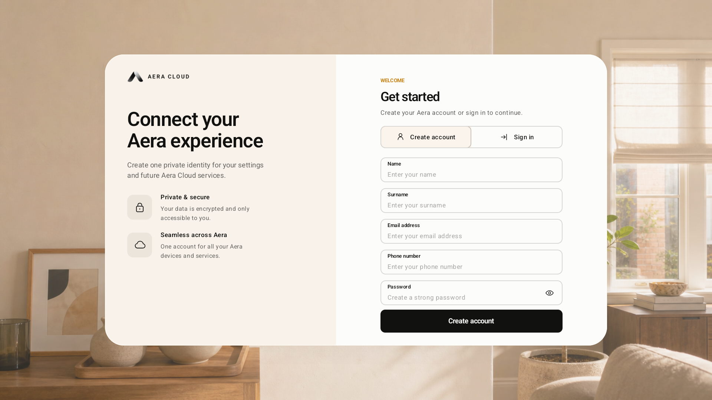
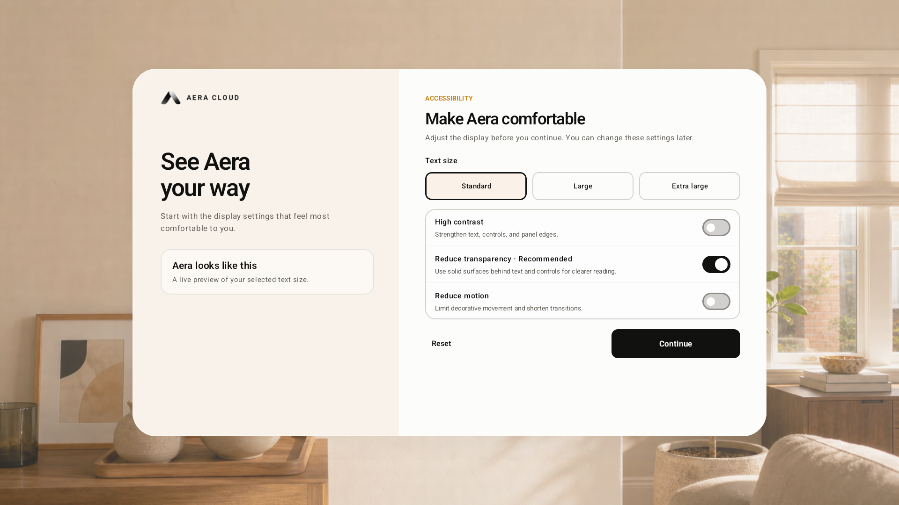
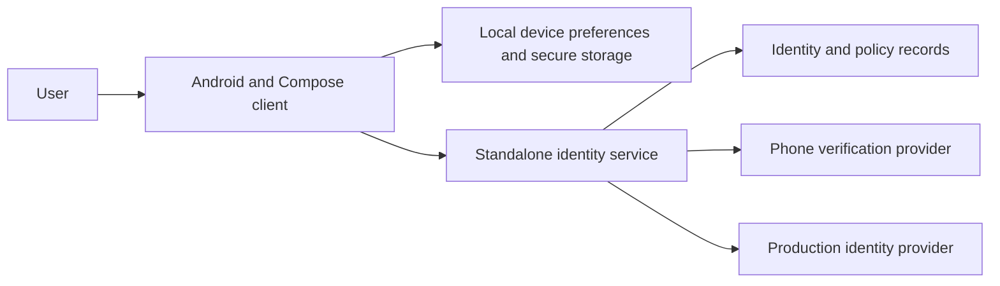

# Aera Cloud

### An account experience designed for the glasses

**An Aera project case study by Enrico Fabri**

Aera Cloud explores a guided first-run experience: accessibility preferences, connectivity, account creation, verification, and device setup. A standalone Android prototype connects to a separate identity service, keeping the account experience independent from the operating-system shell.

*Android prototype capture. All input fields are empty; no personal account information is shown.*

## My role

My role across Aera is **OS architecture with AI-assisted development**. This companion case study explains how the account experience is separated from the OS and how its user interface and identity service fit together.

## The experience

1. **Set up accessibility:** adjust text size, contrast, transparency, and motion before account access.
2. **Connect:** complete the prototype's network setup.
3. **Create an account:** enter account details, verify a phone number, and accept the required policies.
4. **Set up the device:** choose an Aera identity, create a device PIN, and save device preferences.

The registration flow has three visible stages: account details, phone verification, and policy acceptance. Sign-in also requires phone verification before a session is issued.

*The accessibility screen offers a live text-size preview and controls for contrast, transparency, and motion.*

## Technology

| Layer | Stack and purpose |
| --- | --- |
| Android client | Kotlin and Jetpack Compose for the account UI |
| Local device storage | Android Keystore-backed encrypted records for sensitive session/device information |
| Identity service | Kotlin and Spring Boot for registration, verification, activation, and sessions |
| Development data | H2 for the local prototype |
| Production integration design | PostgreSQL, Amazon Cognito, and Twilio Verify |
| Verification workflow | Unit tests, Android lint/build checks, and emulator instrumentation |

**Status:** functional local prototype. Production integrations are a deployment design and implementation boundary, not a claim that a public production service is live.

## Architecture at a glance

*Conceptual view. Local development substitutes test behavior for external identity and message-delivery services.*

## Challenges and decisions

- **Accessibility comes first.** People can adjust readability and motion before navigating account screens.
- **Keep the client and identity backend independent.** The prototype can evolve without changing the Aera OS implementation.
- **Make account activation a server decision.** Verification and policy acceptance gate activation rather than relying only on the visible UI.
- **Separate development and production behavior.** Local testing can exercise the full flow without sending real messages; production requires configured external services.
- **Treat device setup separately from account identity.** A device PIN and local preferences serve a different purpose from the account's server-side identity.

Read the [flow and architecture notes](docs/ARCHITECTURE.md).

## Explore Aera

- [Aera OS: spatial interface and app platform](https://github.com/enricobfabri-cloud/aera-os-showcase)
- [Enrico Fabri on GitHub](https://github.com/enricobfabri-cloud)

## Source and availability

This repository contains selected prototype screenshots and explanatory documentation. **The implementation source remains private because it contains proprietary technology.** No credentials, account records, private API contracts, or runnable backend are published here. There is no public live demo at present.

Prepared in September 2026 from the implemented local prototype. Product screens and implementation may continue to evolve.

Aera names, visual assets, and proprietary implementation remain the property of their respective rights holders. Publication of this case study does not grant an open-source license to the product.
