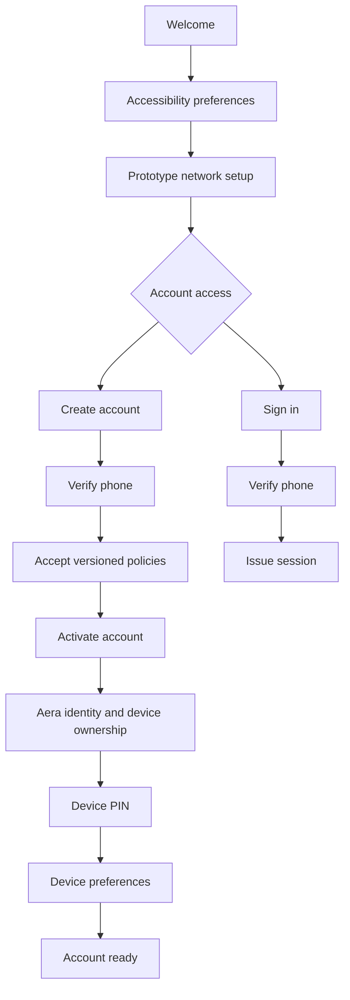

# Aera Cloud: flow and architecture

The account prototype and identity backend are separate from Aera OS. This public summary explains their responsibilities without disclosing source, credentials, private endpoints, or operational configuration.

## From first run to an account

This is an overview of the prototype's intended navigation and enforced account gates. It omits retries, validation errors, recovery boundaries, and provider-specific details.

## Responsibilities

| Area | Responsibility |
| --- | --- |
| Compose client | Navigation, forms, validation feedback, accessibility, and device setup |
| Identity service | Registration state, verification gates, policy records, activation, and sessions |
| Device storage | Local preferences and protected session/device records |
| External production providers | Phone verification and production credential management when configured |

## Design tradeoffs

### Accessibility before authentication

Text and presentation preferences are useful before a person enters their first credential. Exposing these controls early adds a setup step but makes later screens usable with the chosen settings.

### Backend rules instead of UI-only gates

Account activation depends on verified registration state and policy acceptance. Keeping these gates in the service avoids treating a screen transition as proof that the required steps happened.

### A separate identity boundary

The Android client consumes the service rather than embedding account storage or verification-provider secrets. This separation also lets the OS interface and account prototype evolve independently.

### Local flow testing without real messages

The development profile can exercise verification locally. Production uses separately configured providers and must not expose local test behavior. A complete local demonstration does not establish production readiness.

## Evidence and limits

The private workspaces include the Android prototype, identity backend, tests, and design captures. This case study documents their architecture; it does not claim an independent security audit, certification, or a released production identity service.

Published images show blank forms and accessibility settings. The repository contains no user records or authentication material.
